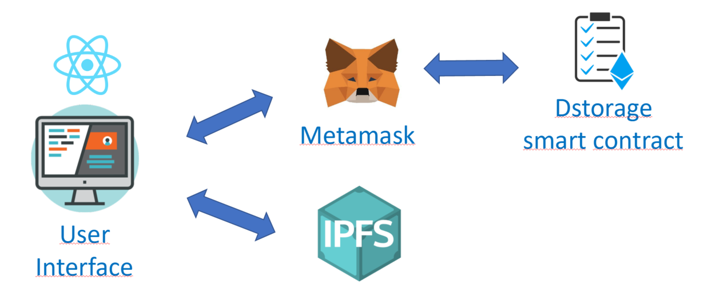

`#Ethereum`

# mTC DStorage

This is a Decentralized Storage which allows the end user to upload a file to the IPFS system and record its ownership into the blockchain.

## Table of Contents

- [Getting Started](#getting-started)
- [The Project](#the-project)
- [Resources](#resources)

## Getting Started

These instructions will get you a copy of the project up and running on your local machine for development and testing purposes.

### The repository

First, you will need to `clone` or `fork` the repository into your Github account:


```
$ git clone https://github.com/miquelTC/decentralized-storage.git
```

### Installing

First, you will need to install the dependencies with: `npm install`.

Run the following command in your terminal after cloning the main repo:

```
$ npm install
```

Then, you will need to install Truffle globally by running the following command int your terminal:

```
$ npm install -g truffle
```

### Running the Tests

First, you will have to compile the smart contracts by running the following command in your terminal:

```
$ truffle compile
```

Then you will have to install and run Ganache to run your blockchain locally:

https://www.trufflesuite.com/ganache

Then, the tests that validate your solution can be executed by runing the following
command:

```
$ truffle test
```

### Deployment on Local Blockchain

Deploy the contracts on your Ganache local blockchain by running the following command:

```
$ truffle migrate
```

### Opening the User Interface

First of all, it is required to install Metamask wallet as a browser extension: https://metamask.io/

Then you should configure Metamask to connect to your local blockchain run by Ganache. This requires the following:
- Open Metamask
- Open the Network Configuration panel
- Open Custom RPC
- Configure your private network by adding `http://localhost:7545` on the URL and `1337` as a chain ID.
- Import the first Ganache Account to Metamask by copying the Account Private Key from Ganache and pasting it on Metamask

Finally you just need to run the following command in your terminal to open the User Interface:

```
$ npm start
```

### Deployment on Public Network

In order to deploy your smart contract, you must create your .env file and specify:

- `PRIVATE_KEYS` --> Private Key of the account you are using to deploy (typically the first one in the list of Ganache)
- `INFURA_API_KEY` --> API key provided by Infura: https://infura.io

Then, you will need to run the following command (let's use the testnet Ropsten in this example, remember to request some Ether for your account using a faucet):

```
$ truffle migrate --network ropsten
```

Finally you can run the following command to generate the build artifacts of your User Interface and then deploy to your favourite host:

```
npm run build
```


### Technology stack

- `Solidity`
- `React`
- `Truffle`
- `Web3.js`
- `Ganache`
- `Node.js`
- `Metamask`

## The Project

This project consists in a decentralized storage system, being kind of a Dropbox but in a more devcentralized manner. It allows the user to upload a file to a decentralized system called IPFS (Inter Planetary File System), sharing it with anyone who knows the hash identifier. On top of it, the ownership gets tracked on the blockchain. The components of this project are:

- A smart contract to track some file specifications such as size, type, uloader, file hash...
- Tests built with JavaScripts to ensure smart contracts are accomplishing the expected functionalities
- A React.js front-end application as a user interface

### Project architecture



The user can access the application via web-browser, and he must have the Metamask wallet installed. This interface, built with React.js, relies on the web3.js library to communicate with the smart contracts through Metamask. This means that the data reflected on the front-end application is fetched from the Ethereum blockchain. Each action performed by the user (in this case, uploading a file to IPFS) creates a transaction on Ethereum, which will require Metamask confirmation and pay an small fee, and this transaction will permanently modify the state of the DStorage smart contract. On top of it, the user will deliver a file to the IPFS, creating a permanent hash which can be used as identifier for this file in this system.

### DStorage features


The user can basically execute a couple of actions in this DApp:

#### Select a file

The user can select a file from his local machine and type a description on the description input section.

#### Upload a file

Once the user has selected the file he wants to upload, then he must click on the UPLOAD button. At this point, Metamask will ask for a confirmation, and once confirmed, the user will pay an small fee to record the following on the blockchain: Id, Name, Description, Type, Size, Date, Uploader and Hash. This information will be displayed at the bottom of the screen. Of course the file is now uploaded to the IPFS


## Resources

- [ethereum.org](https://ethereum.org/)
- [truffle suit](https://www.trufflesuite.com/)
- [node.js](https://nodejs.org/)
- [web3.js](https://web3js.readthedocs.io/)
- [react.js](https://reactjs.org/)
- [IPFS](https://ipfs.io/)